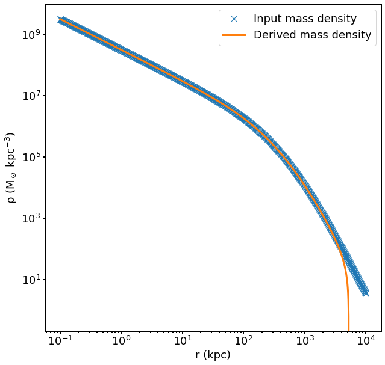

.. _virial:

Generating Virial Equilibrium Models
------------------------------------

Overview
========

The dark matter and stellar components of galaxy clusters in 
``cluster_generator`` are modeled assuming collisionless dynamics in
virial equilibrium. The mass density of such a system can be derived 
by integrating the phase-space distribution function 
:math:`f({\bf r}, {\bf v})` over velocity space: 

.. math::

    \rho({\bf r}) = \int{f({\bf r}, {\bf v})d^3{\bf v}}

where :math:`{\bf r}` and :math:`{\bf v}` are the position and velocity
vectors. Assuming spherical symmetry and isotropy, all quantities are 
simply functions of the scalars :math:`r` and :math:`v`, and 
:math:`d^3{\bf v} = 4\pi{v^2}dv`:

.. math::

    \rho(r) = 4\pi\int{f(r, v)v^2dv}

Assuming zero net angular momentum for the cluster, there is a unique 
distribution function :math:`f(E)` which corresponds to the density
:math:`\rho(r)`. Since the total energy of a particle is 
:math:`E = v^2/2 + \Phi` (where :math:`\Phi(r)` is the gravitational
potential) and further defining :math:`\Psi = -\Phi` and 
:math:`{\cal E} = -E = \Psi - \frac{1}{2}v^2`, we find:

.. math::

    \rho(r) = 4\pi\int_0^{\Psi}f({\cal E})\sqrt{2(\Psi-{\cal E})}d{\cal E}

After differentiating this equation once with respect to :math:`\Psi` and
inverting the resulting Abel integrel equation, we finally have:

.. math::

    f({\cal E}) = \frac{1}{\sqrt{8}\pi^2}\left[\int^{\cal E}_0{d^2\rho \over d\Psi^2}{d\Psi
    \over \sqrt{{\cal E} - \Psi}} + \frac{1}{\sqrt{{\cal E}}}\left({d\rho \over d\Psi}\right)_{\Psi=0} \right]

which given a density-potential pair for an equilibrium halo, can be used to
determine particle speeds. For our cluster models, this equation must 
(in general) be solved numerically, even if the underlying dark matter, 
stellar, and gas densities can be expressed analytically. 

The :class:`~cluster_generator.virial.VirialEquilibrium` Class
==============================================================

The integration of the Eddington formula is handled in ``cluster_generator``
using the :class:`~cluster_generator.virial.VirialEquilibrium` class. There are
two ways to create a :class:`~cluster_generator.virial.VirialEquilibrium` object.

If you want to model a dark matter halo without gas, set up a total density
profile using the :meth:`~cluster_generator.virial.VirialEquilibrium.from_scratch`
method:

.. code-block:: python

    import cluster_generator as cg
    # Create a Hernquist total density profile
    M_0 = 5e14 # units of Msun
    a = 500.0 # units of kpc
    total_density = cg.hernquist_density_profile(M_0, a)
    # Create the virial model
    rmin = 0.1 # minimum radius in kpc
    rmax = 10000.0 # maximum radius in kpc
    num_points = 1000 # the number of samples along the radial profile, optional
    vir = cg.VirialEquilibrium.from_scratch(rmin, rmax, total_density, 
                                            num_points=num_points)
                                            
If there are stars in the cluster model (and not dark matter only) then it is 
possible to supply a stellar mass density profile as well via the 
``stellar_profile`` argument:

.. code-block:: python
    
    # Create a Hernquist stellar density profile
    M_star = 5.0e12 # units of Msun
    a_star = 50.0 # units of kpc
    stellar_density = cg.hernquist_density_profile(M_star, a_star)
    vir = cg.VirialEquilibrium.from_scratch(rmin, rmax, total_density, 
                                            stellar_profile=stellar_density)

By default, the :meth:`~cluster_generator.virial.VirialEquilibrium.from_scratch`
and :meth:`~cluster_generator.virial.VirialEquilibrium.from_hse_model` methods 
return a :class:`~cluster_generator.virial.VirialEquilibrium` object that
can produce dark matter particles. If you want to create an object that can
produce star particles, set ``ptype="stellar"``. You can even create two 
:class:`~cluster_generator.virial.VirialEquilibrium` objects; one for dark 
matter particles, and the other for stars, from the same input model:

.. code-block:: python

    vir_dm = cg.VirialEquilibrium.from_hse_model(hse, ptype="dark_matter")
    vir_star = cg.VirialEquilibrium.from_hse_model(hse, ptype="stellar")

Checking the Accuracy of the Model
++++++++++++++++++++++++++++++++++

After generating a :class:`~cluster_generator.virial.VirialEquilibrium` object,
it is probably a good idea to check that the resulting distribution function
is consistent with the input mass density profile. The 
:meth:`~cluster_generator.virial.VirialEquilibrium.check_model` method can be
used to perform a quick check on the accuracy of the model. This method returns
two NumPy arrays, the first being the density profile computed from integrating 
the distribution function, and the second being the relative difference between 
the input density profile and the one calculated using this method.

.. code-block:: python

    import matplotlib.pyplot as plt
    rho, diff = vir.check_model()
    # Plot this up
    fig, ax = plt.subplots(figsize=(10,10))
    ax.loglog(vir["radius"], vir["total_density"], 'x', label="Input mass density", markersize=10)
    ax.loglog(vir["radius"], rho, label="Derived mass density", lw=3)
    ax.legend()
    ax.set_xlabel("r (kpc)")
    ax.set_ylabel("$\mathrm{\\rho\ (M_\odot\ kpc^{-3})}$")

One can see that the derived density diverges from the input density at large
radii, due to difficulties with numerically integrating to infinite radius. So long
as the maximum radius of the profile is very large, this should not matter very
much.

Generating Particles
++++++++++++++++++++

Once a :class:`~cluster_generator.virial.VirialEquilibrium` object is created,
it can be used to generate particle positions and velocities. The positions are
generated by drawing uniform random numbers :math:`u \in [0, 1]`, and inverting
the equation :math:`u = M(<r)/M_{\rm tot}` to find the radius :math:`r`. Since
the cluster is spherically symmetric, the particle positions are isotropically
distributed in the tangential directions :math:`\theta` and :math:`\phi`. 

To generate the particle speeds, the distribution function :math:`f({\cal E})`
is used with uniform random numbers :math:`u \in [0, 1]` via an 
acceptance-rejection method. The particle velocity components are isotropically
distributed in the tangential directions :math:`\theta` and :math:`\phi`.

The :meth:`~cluster_generator.virial.VirialEquilibrium.generate_particles`
method carries out these functions, and also assigns particle masses, given
the number of particles one wishes to be generated:

.. code-block:: python
    
    n_dm = 1000000 # number of particles to generate
    dm_particles = vir.generate_particles(n_dm)

By default, this method will only determine particle positions, velocities,
and masses. If you want to add a field with the particle gravitational
potential, set ``compute_potential=True``. If you want to limit the
generation of particles to within a certain radius, set ``r_max`` equal to
the desired radius in kpc (otherwise the maximum radius will be value 
which was originally supplied in the creation of the
:class:`~cluster_generator.virial.VirialEquilibrium` object):

.. code-block:: python

    n_dm = 1000000 # number of particles to generate (now within r_max)
    r_max = 5000.0 # maximum radius of particles in kpc
    dm_particles = vir.generate_particles(n_dm, r_max=r_max, 
                                          compute_potential=True)

The object returned by 
:meth:`~cluster_generator.virial.VirialEquilibrium.generate_particles` is
a :class:`~cluster_generator.cluster_particles.ClusterParticles` object,
which is covered in more detail in :ref:`particles`.