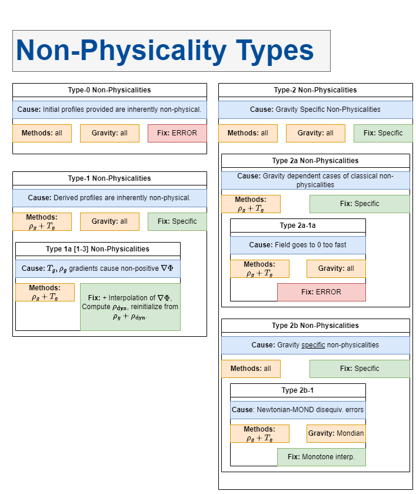

.. _correction:

Correcting Non-Physical Behavior
================================

In many cases, perfectly reasonable initial profiles (be they :math:`\rho_g`, :math:`T`, :math:`\rho_{\mathrm{dyn}}` or others)
can lead to manifestly non-physical final clusters when all of the calculations have been made. There are generally 3 reasons why
this can occur:

- **The profiles are explicitly flawed**

  - Example: You ask CGP to create initial conditions for a negative ICM temperature.

- **The profiles lead to non-physicalities because of their shapes**

  - Example: You create a gas density profile and a temperature profile, but they're not intrinsically connected. Sometimes they
    won't be viable together in a single system.

  - Another case in which this occurs regularly is that :math:`\rho_g` and :math:`T_g` profiles in the literature are only constructed
    on a particular domain and are fit independent of any constraints they impose on one another. While this is fine for many observational
    purposes, it can lead to inconsistencies.

- **The gravity theory you've chosen causes problems**

  - Example: You choose a temperature profile that goes as :math:`1/r` at large radii, but you're also using MOND gravity where
    :math:`T_g \sim r^0` for asymptotic stability.

Clearly, there are a variety of ways that these things can happen and they're often hard to predict as the end user. In previous
initial conditions software, it was generally left up to the end user to construct self-consistent profiles (which could be a lot of work).
The CGP is geared toward making the initialization process as simple as possible to facilitate easier science and therefore
comes with a set of algorithms for detection and correction of these non-physicalities.

.. raw:: html

   

.. contents::

.. raw:: html

   

Non-Physical Regions
--------------------

To contend with the issue of non-physical regions, the CGP provides the :py:mod:`correction` module which is composed of
class objects descended from :py:class:`correction.NonPhysicalRegion`. Each of these classes represents a particular category of
non-physical region and has subclasses representing the documented sub-cases of the non-physicality described. As such, to get
started correcting non-physical regions, it is first important to understand how they are categorized.\

    All of the possible non-physicalities which occur in the CGP.

Type 0 Non-Physicalities
''''''''''''''''''''''''

.. inheritance-diagram:: cluster_generator.correction.Type0aNPR cluster_generator.correction.Type0bNPR cluster_generator.correction.Type0cNPR
    :parts: 1

.. rubric:: Non Physical Region Classes

.. py:currentmodule:: correction

.. autosummary::
    :template: class.rst

    Type0NPR
    Type0aNPR
    Type0bNPR
    Type0cNPR

.. rubric:: Causes

Type 0 non-physicalities occur when something is explicitly wrong with the profiles the user has provided.

.. tab-set::

    .. tab-item:: From :math:`\rho_g + T_g`

        If the density profile is found to be negative, then it will result in a :py:class:`correction.Type0bNPR` instance. If
        the temperature profile is inconsistent, then it will result in a :py:class:`correction.Type0aNPR`.

    .. tab-item:: From :math:`\rho_g + \rho_{\mathrm{dyn}}`

        A :py:class:`correction.Type0bNPR` occurs if any of the following happen:

        - :math:`\rho_g < 0`
        - :math:`\rho_{\mathrm{dyn}} < 0`
        - :math:`\rho_g > \rho_{\mathrm{dyn}}`

    .. tab-item:: From :math:`\rho_g + S_g`

        The :math:`\rho_g + S_g` approach is entirely equivalent to the :math:`\rho_g+T_g` approach. Given that
        If the density profile is found to be negative, then it will result in a :py:class:`correction.Type0bNPR` instance. If
        the entropy profile is inconsistent, then it will result in a :py:class:`correction.Type0aNPR`.

    .. tab-item:: Without gas

        A :py:class:`correction.Type0bNPR` arises if the input density profile is negative.

Type 1 Non-Physicalities
''''''''''''''''''''''''

.. inheritance-diagram:: cluster_generator.correction.Type1aNPR
    :parts: 1

.. rubric:: Non Physical Region Classes

.. py:currentmodule:: correction

.. autosummary::
    :template: class.rst

    Type1NPR
    Type1aNPR

.. rubric:: Causes

Type 1 non-physical regions are the most commonly occurring class. These arise when some aspect of the provided profiles
is inconsistent during later steps of the computation process.

.. tab-set::

    .. tab-item:: From :math:`\rho_g + T_g`

        .. note::

            The :math:`\rho_g + T_g` approach is the most temperamental of the generation approaches; however it is also
            the most useful for matching observational properties of clusters. We therefore encourage every user to understand
            the non-physicalities described in this section.

        In the :math:`\rho_g + T_g` approach, temperature and density profiles are provided from which HSE is used to determine the gravitational field. From
        the field, we can finally determine the dynamical mass. If both :math:`\rho_g, T_g` are self-consistent, then the gravitational field follows from HSE as

        .. math::

            \nabla \Phi = \frac{-k_b T}{m_p \eta} \left[\frac{d\ln(\rho_g)}{dr} + \frac{d\ln(T)}{dr} \right].

        If **both profiles are monotonically decreasing**, then :math:`\nabla \Phi > 0` which is consistent. The criterion for a non-physicality is (by Gauss' Law) that
        :math:`\nabla \Phi > 0`. Therefore, an inconsistency arises if the derivative factor of the expression is non-negative.

        .. admonition:: Type 1 Non-Physicalities

            There are three Type 1 non-physicalities which can arise in this case:

            - **Type 1a-1**: :math:`\nabla_r \rho_g > 0` and :math:`|\nabla_r \ln(T_g)| < |\nabla_r \ln(\rho_g)|`. (The density is increasing too fast)
            - **Type 1a-2**: :math:`\nabla_r T_g > 0` and :math:`|\nabla_r \ln(T_g)| > |\nabla_r \ln(\rho_g)|`. (The temperature is increasing too fast)
            - **Type 1a-3**: :math:`\nabla_r T_g > 0` and :math:`\nabla_r \rho_g > 0`.

        Of these, Type 1a-2 is by far the most common because in **cool-core clusters**, the temperature gradient does go positive and therefore must be
        limited.

    .. tab-item:: From :math:`\rho_g + \rho_{\mathrm{dyn}}`

        The :math:`\rho_g + \rho_{\mathrm{dyn}}` approach is almost entirely self consistent. Only Type 0 non-physicalities occur
        in this case.

    .. tab-item:: From :math:`\rho_g + S_g`

        The :math:`\rho_g + S_g` approach is entirely equivalent to the :math:`\rho_g+S_g` approach. Given that

        .. math::

            S(r) = k_bT_g(r)n_e(r)^{-2/3},

        A temperature profile is immediately specified which must meet all of the criteria for the temperature profile in the :math:`\rho_g + T_g` approach.

    .. tab-item:: Without gas

        This approach is entirely self-consistent as long as the density profile provided is physical.

Type 2 Non-Physicalities
''''''''''''''''''''''''

Type 2 Non-Physical regions occur when some aspect of the gravitational theory being used is inconsistent with the
profiles provided and thus leads to non-physical results.

.. note::

    These classes will be implemented with the upcoming gravity update.

.. raw:: html

   

Correcting Non-Physical Behavior
--------------------------------

Now that we've established the types of non-physical regions (NPRs), we are ready to discuss how to fix them. Some non-physical regions
are not reparable (largely because they indicate a failure that we deem should be made obvious to the user); however, wherever possible we
have constructed purpose built algorithms to provide the best possible reconstruction methods to excise NPRs.

The core utility of the :py:mod:`correction` module is not simply to categorize NPRs but also to fix them. As such, every
class in the module has two core methods: :py:meth:`correction.NonPhysicalRegion.identify` and :py:meth:`correction.NonPhysicalRegion.correct`. These
attempt to identify the NPRs corresponding to that type and correct them respectively. Each takes a ``recursive`` keyword argument which will tell
the system whether or not to check all of the available subclasses in the same way. In some cases, an NPR isn't fixable in which case a :py:class:`correction.CorrectionFailure` will
be raised indicating that an error has occurred. In most cases, these are used to indicate that the user has made an error which is severe enough to warrant a complete reconsideration
of the model.

.. note::

    For more examples on how this process works in practice, visit the :ref:`examples` page. For a more in-depth explanation of
    correction methodologies, visit :ref:`correction_methods`.

Adding a New NPR
----------------

If you're a contributor to the CGP, then you may find yourself in a situation where you need to add a new NPR type to the
:py:mod:`correction` module. The process to do so is relatively simple. Every novel NPR class should fit into a category and
inherit directly from the next highest level NPR in the tree. The generic template for such an addition should look like this

.. code-block:: python

    class Type__NPR(Type__NPR):
    r"""
    Non-Physical Region corresponding to regions of the cluster where **INSERT YOUR DESCRIPTION**.

    +--------------+-----------------------------+
    | Properties                                 |
    +==============+=============================+
    | Scope        | Type <type>                 |
    +--------------+-----------------------------+
    | Methods      | <methods>                   |
    +--------------+-----------------------------+
    | Gravity      | <grav types>                |
    +--------------+-----------------------------+
    | Correctable? | <correctable>               |
    +--------------+-----------------------------+

    **Class Diagram**

    .. inheritance-diagram:: cluster_generator.correction
        :parts: 1

    Notes
    -----
    Documentation notes.

    """

    _methods = [""]
    _message = """
    NPR of type <type>: <Your description of the new NPR>
    """
    _scope = "<type>"
    correctable = True # --> Is this NPR correctable?

    def __init__(self, rmin, rmax, obj):
        super().__init__(rmin, rmax, obj)

    @classmethod
    def _identify(cls, model):
        nprs = []  # The NPRs being returned

        #
        # YOUR CODE TO IDENTIFY THE NPR GOES HERE.
        #
        return nprs

    def _correct(self, **kwargs):

        #
        # YOUR CORRECTION CODE GOES HERE.
        #

        return New_Model
