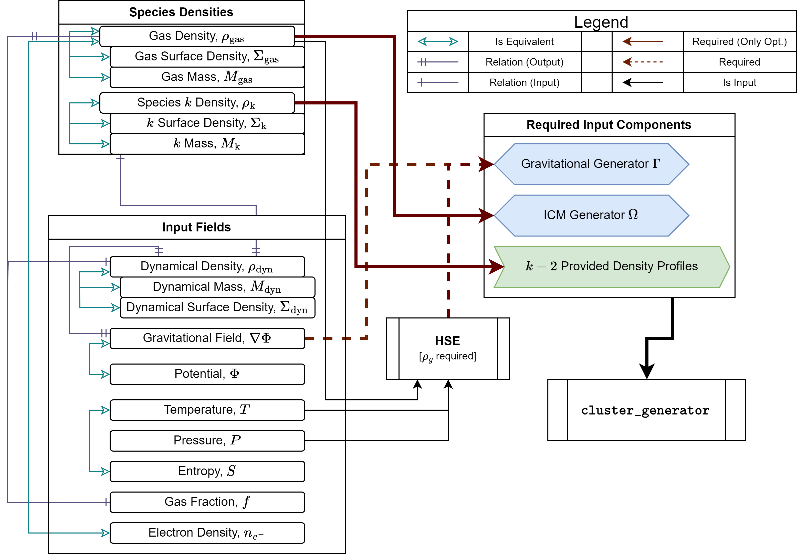
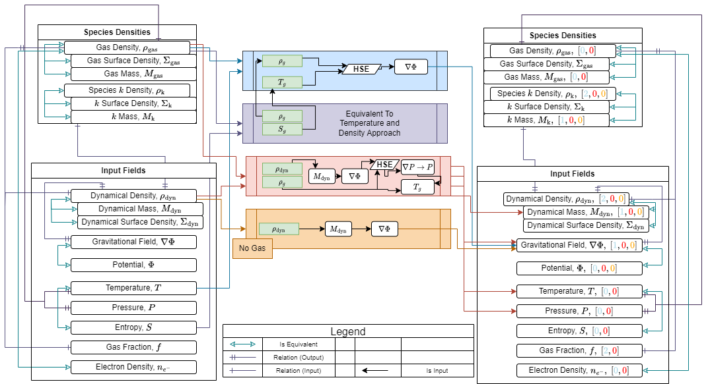
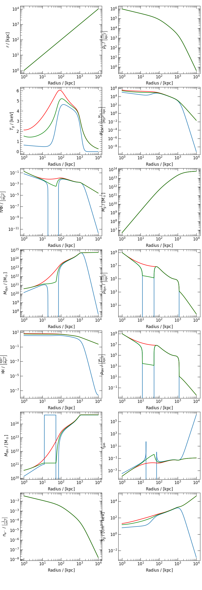

.. _correction:

Correcting Non-Physical Behavior
================================

In many cases, perfectly reasonable initial profiles (be they :math:`\rho_g`, :math:`T`, :math:`\rho_{\mathrm{dyn}}` or others)
can lead to manifestly non-physical final clusters when all of the calculations have been made. There are generally 3 reasons why
this can occur:

- **The profiles are explicitly flawed**

  - Example: You ask CG to create initial conditions for a negative ICM temperature.

- **The profiles lead to non-physicalities because of their shapes**

  - Example: You create a gas density profile and a temperature profile, but they're not intrinsically connected. Sometimes they
    won't be viable together in a single system.

  - Another case in which this occurs regularly is that :math:`\rho_g` and :math:`T_g` profiles in the literature are only constructed
    on a particular domain and are fit independent of any constraints they impose on one another. While this is fine for many observational
    purposes, it can lead to inconsistencies.

- **The gravity theory you've chosen causes problems**

  - Example: You choose a temperature profile that goes as :math:`1/r` at large radii, but you're also using MOND gravity where
    :math:`T_g \sim r^0` for asymptotic stability.

Clearly, there are a variety of ways that these things can happen and they're often hard to predict as the end user. In previous
initial conditions software, it was generally left up to the end user to construct self-consistent profiles (which could be a lot of work).
CG is aimed at making simulation setup as easy as possible and therefore provides tools for semi-automatic correction of non-physical clusters.

.. rubric:: Content

.. contents::

.. raw:: html

   

What Causes Non-Physical Regions?
---------------------------------

Behind the scenes, CG uses a relatively complex set of mechanisms to generate a galaxy cluster from the minimal set of profiles provided by
the user. In general, even if the user provides a set of perfectly reasonable (or at least apparently reasonable) profiles, there is no guarantee
that those profiles are inherently compatible with the physical constraints of the cluster. To understand this better, it should be noted that there
are 3 core constraints in the process of generating a cluster: the conservation of mass (dynamical mass is the sum of all other mass species), gravitation (links thermodynamics and
collisionless mass components), and hydrostatic equilibrium (HSE). In the most general case, there may be :math:`n-1` collisionless mass species provided explicitly, producing :math:`n` constraints on the mass components (sum of all
species must add to total density). If the cluster has gas, then there must be some quantity which is (up to an isomorphism) equivalent to the gas density. In this context, we call such a quantity
a gas density proxy; however, it could be gas density itself. Finally, there needs to be
some gravitational proxy like the dynamical mass, the potential, or the potential gradient. With these :math:`n+1` total constraints, the entire system is
calculable; however, it need not be physically consistent.

    A diagram of the relevant constraints and how they are related along with the possible pathways to a
    fully realized cluster model.

What does any of this have to do with non-physicality? Because these pathways are the necessary constraints used to generate
all of the clusters created by CG, one may reduce the problem of how non-physicalities arise in general to the question of how they arise
from more general proxies. A more detailed description of the relevant pathways from which to build cluster models reveals that [Diggins] any
non-physicality in a cluster is necessarily manifested in the :math:`\rho_{\mathrm{dyn}}` profile. This is a critical result as it allows for the
implementation of a 1-size-fits-all solution to non-physical clusters. The basic idea is to identify the core constraint on the dynamical density and correct it from there.

    A comprehensive diagram of the cluster generation processes used in ``cluster_generator``.
    The left hand column indicates input quantities, the right hand side output quantities. The central column describes the different generation algorithms.
    Brackets following output quantities show the relative smoothness of the output. If the least smooth input function is :math:`f \in C^n[a,b]`, then an output with a bracketed value :math:`k` will be :math:`g\in C^{n-k}[a,b]`.
    Values with 0 may be as smooth or more than the input.

Correcting Non-Physical Regions
-------------------------------

In the previous section, we discussed the key result that all non-physical behaviors in galaxy cluster models are necessarily manifested in the
dynamical density profile. Given this, the name of the game becomes correcting the dynamical density profile. The constraint which must be obeyed is that

.. math::

    \rho_{\mathrm{dyn}}(r) = \sum_{i} \rho_{i}(r),

where the sum over :math:`i` represents all of the relevant species of mass contribution. This is the core correction which must be performed in order
to correct issues in galaxy cluster models. If the dynamical mass falls below this threshold, there are immediately non-physical ramifications.

The Minimal Correction
++++++++++++++++++++++

In a naive sense, the easiest way to correct these non-physical regions is the force the dynamical density to be equal to or greater than the
required critical density and that radius. Thus, if

.. math::

    \rho_{\mathrm{critical}} = \sum_i \rho_i(r),

then the simple transformation

.. math::

    \rho_{\mathrm{dyn}}(r) = \begin{cases}\rho_{\mathrm{dyn}}(r),&\rho_{\mathrm{dyn}}(r) \ge \rho_{\mathrm{critical}}\\\rho_{\mathrm{critical}},&\rho_{\mathrm{dyn}}(r) < \rho_{\mathrm{critical}}\end{cases}

will rebuild the cluster in such a way that it is forced to be physically realizable. This correction approach is called the **minimal correction method (MCM)**. It has advantages and disadvantages just as all of the other
correction methods. Because it defines a piecewise :math:`\rho_{\mathrm{dyn}}`, the profile will be potentially discontinuous at a finite number of points. This is clearly an unnatural configuration; however, because all of the other
quantities involved in the cluster are generated by integration from :math:`\rho_{\mathrm{dyn}}` all other profiles are at least continuous and most are also smooth.

The Smooth Correction
+++++++++++++++++++++

An improvement on the approach of the MCM is the SCM, or smooth correction method. The basic principle of this correction method is the
same as that of the minimal approach; however, this approach replaces :math:`\rho_{\mathrm{dyn}}` with a monotone decreasing profile, which is
smooth at all points of the domain. This is a more disruptive approach to correction; however, it produces considerably smoother profiles.

    (Blue) the original, uncorrected, profile for A133 from Vikhlinin et. al. 2006. (Red) the naive / minimal correction method.
